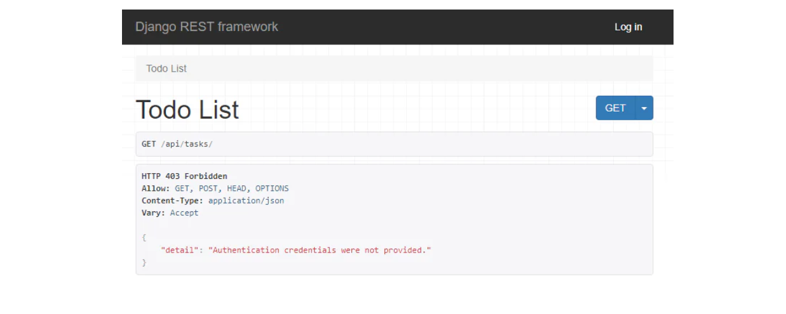
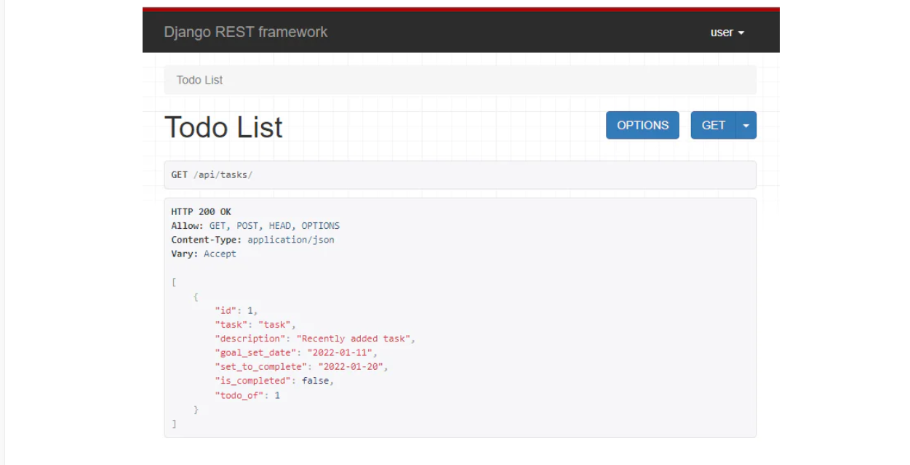
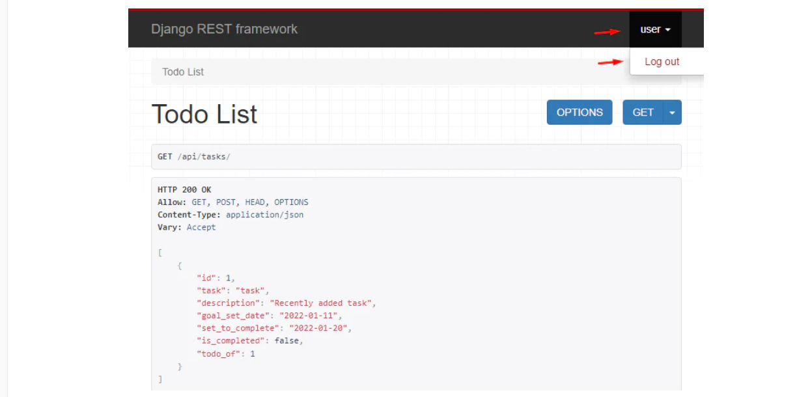
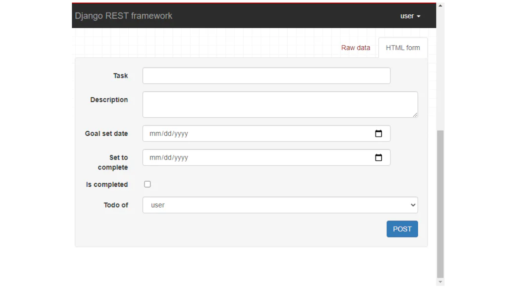
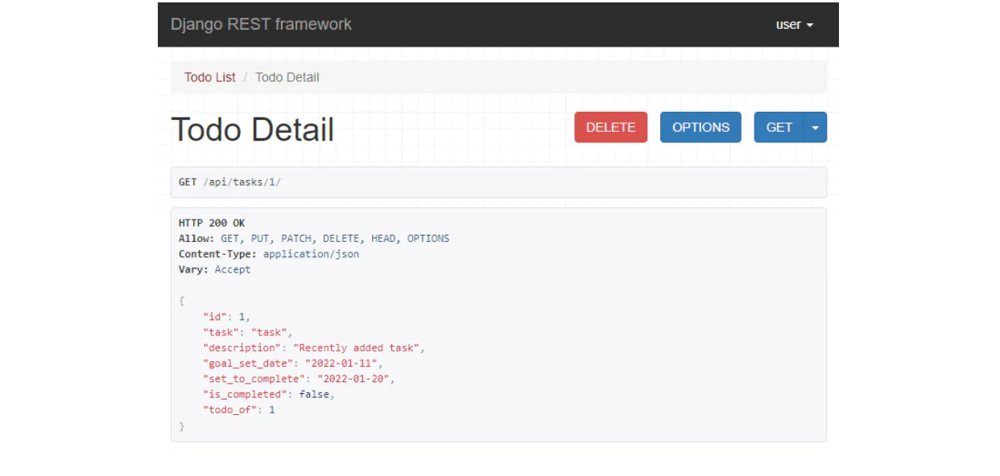
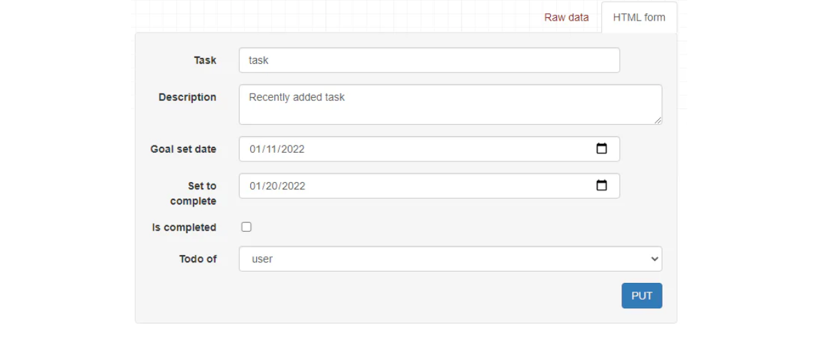
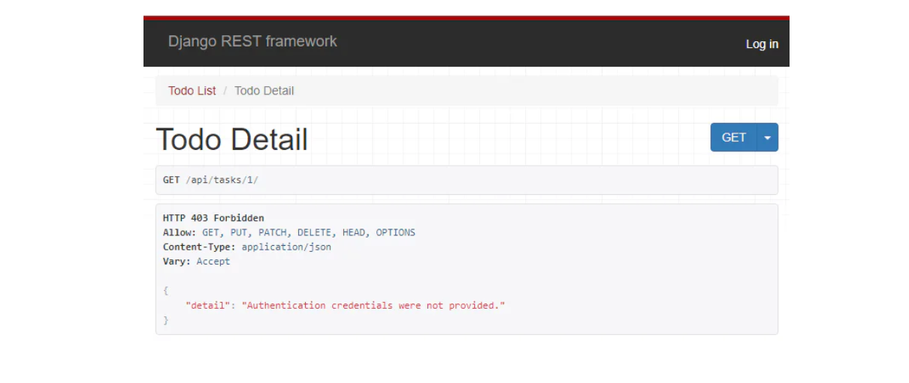

# CRUD and Permissions

## Description

You have created an API that displays user-created tasks. If you want to add, update, or delete any task, you need to login into your superuser account and carry out the tasks from the Django admin panel. It's tedious and inconvenient.

With the help of the API, you should be able to add, update and delete tasks, not only view them. In this stage, you will implement the CRUD functionality in the project that gives access to the app through GET requests to POST, PUT, PATCH, and DELETE. CRUD stands for Create, Read, Update, and Delete, representing the four basic operations performed on database records or data. The POST request adds new data. PUT and PATCH update it. DELETE, just like the name suggests, deletes the data. We can implement this functionality by making simple tweaks in views from the previous stage.

If you look at your project closely, you'll see that anyone can access endpoints. After implementing the CRUD functionality, they can add data, which may lead to spam and trolling. To resolve this, we need to incorporate permissions so that only the registered users can work with the endpoints. You can either write a custom permission class or change the project permission in `settings.py`. It is a good practice to write custom permission, but since your project has only one API app, you can change the permissions from the settings (Project Level Permissions). You can find more about it in the REST Framework documentation.

---

## Objectives

Add a new field in the model that stores the user's ID that created the task. We cannot allow anyone to change the task content of other users, so you need to create a relation between the task and the user. Your API should display all the content to registered users only; reserve the delete and update functionality to the author of the task.

In other words, anyone could access the endpoints in the previous stage. After implementing the permission, if an unregistered user tries to access the data, the response at `localhost:8000/api/tasks/` should be `403 Forbidden`.

Like in the previous stage, you can communicate with the API with the different requests. We will run the server to see how they work at once.

You should also add a login to the browsable API. Use `api-auth` for this purpose. It creates a login link on the top right of the page. You can find more about it in the REST Framework documentation.

Summing up, to pass this stage, you need to:

* Add permissions so that only the registered users can use the API;
* Add more users from the Django admin portal;
* Implement the CRUD functionality in the project;
* Only the task author can update and delete a task; other registered users can view it, non-registered users should not be able to see any tasks.

---

## Examples

### Example 1: response for unregistered users on `localhost:8000/api/tasks/`

```
HTTP 403 Forbidden
Allow: GET, POST, HEAD, OPTIONS
Content-Type: application/json
Vary: Accept

{
    "detail": "Authentication credentials were not provided."
}
```

### Example 2: `localhost:8000/api/tasks/` in a browser

Note that the registered users can access the endpoint as before. Also, notice a Login link in the top right corner. It displays the username of the logged-in user. You can log out using the same link.



### Example 3: response on `localhost:8000/api/tasks/` after logging in and adding one task

```
HTTP 200 OK
Allow: GET, POST, HEAD, OPTIONS
Content-Type: application/json
Vary: Accept

[
    {
        "id": 1,
        "task": "task",
        "description": "Recently added task",
        "goal_set_date": "2022-01-11",
        "set_to_complete": "2022-01-20",
        "is_completed": false,
        "todo_of": 1
    }
]
```

### Example 4: `localhost:8000/api/tasks/` in a browser



### Example 5: `localhost:8000/api/tasks/` in a browser — note the Log out button



### Example 6: `localhost:8000/api/tasks/` in a browser

There is a box right below the displayed data, from where you can add a new task to the database. Add two new data and see how your current data changes.



> Here, **Todo of** is the author user who will be writing the todo.

### Example 7: response for registered users for `localhost:8000/api/tasks/1`

```
HTTP 200 OK
Allow: GET, PUT, PATCH, DELETE, HEAD, OPTIONS
Content-Type: application/json
Vary: Accept

{
    "id": 1,
    "task": "task",
    "description": "Recently added task",
    "goal_set_date": "2022-01-11",
    "set_to_complete": "2022-01-20",
    "is_completed": false,
    "todo_of": 1
}
```

### Example 8: Browsable API at `localhost:8000/api/tasks/1` after login

If you go to the detailed view of the latest task you added at `localhost:8000/api/tasks/<id>/` you will see something like this.



### Example 9: Browsable API at `localhost:8000/api/tasks/1` after login (box right below the displayed data for editing tasks, method PUT)



Here you will also see similar boxes as before, but these will update the task of `<id>` you have requested. You will also notice a DELETE button that deletes the task. If you are not logged in as the owner of the task, you will still be able to see the task, but won't be able to perform Delete and Update operations.

### Example 10: Browsable API at `localhost:8000/api/tasks/1` without logging in


