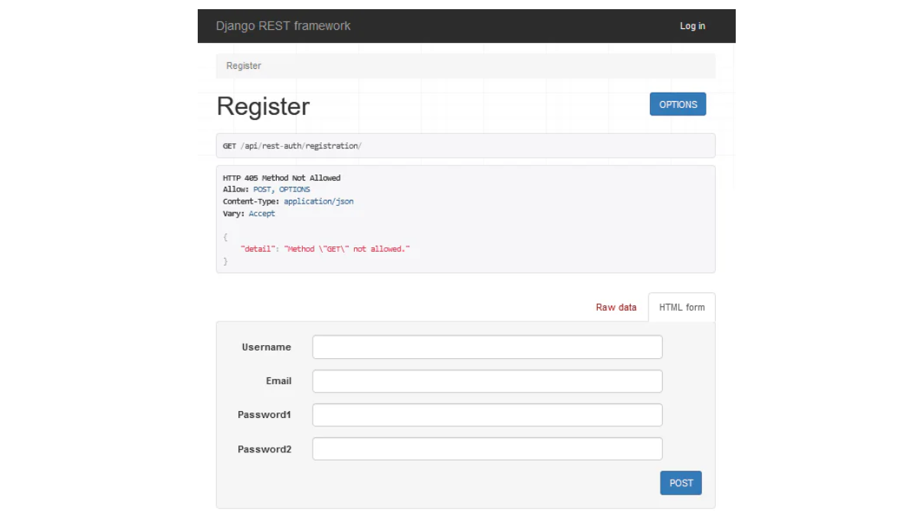
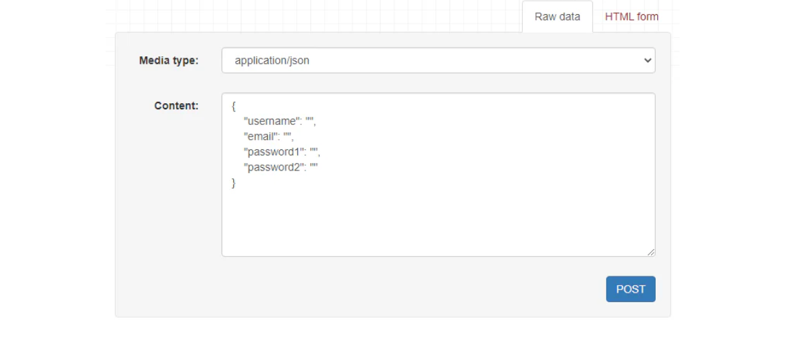
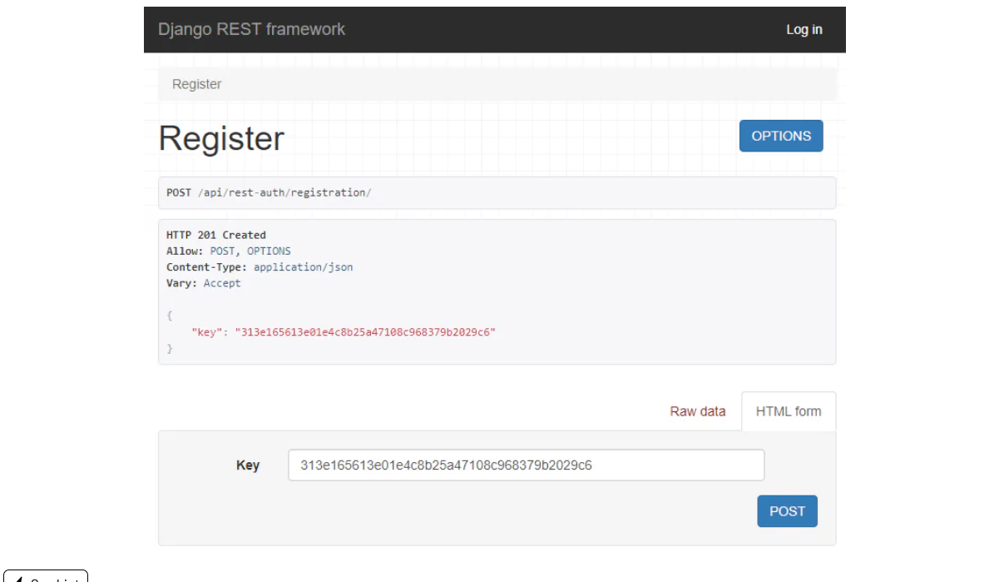

# The More the Merrier

## Description

We have an API that grants access to tasks only to authorized users. We have also upgraded the API to allow CRUD operations. This project still lacks authorization. Until now, you've added users from the Django admin panel; in this stage, you will use the authorization functionality so that new users can register on their own.

---

## Objectives

Django contains no built-in `views` or URLs for user registration, and neither does Django REST Framework. We need to come up with the code from scratch, which is a bit tedious and risky, considering all the security ramifications. To get around this, we can use ready-made, tested third-party packages. For example, [django-allauth](https://docs.allauth.org/en/latest/). You can learn more about installation and integration in the official documentation.

All you need to do in this stage is implement the **sign-in operation** for unregistered users. Please, add the ability to **register new users**.

You will notice various functions offered by the packages like password reset, login, logout, verification, and so on. We won't cover them in this project but feel free to explore. The best part of Django REST Framework is its community and well-documented packages. It will surely be an interesting adventure!

---

## Examples

### Example 1: registering new users in a browser

### Example 2: raw data for registering

### Example 3: response for the valid POST request

