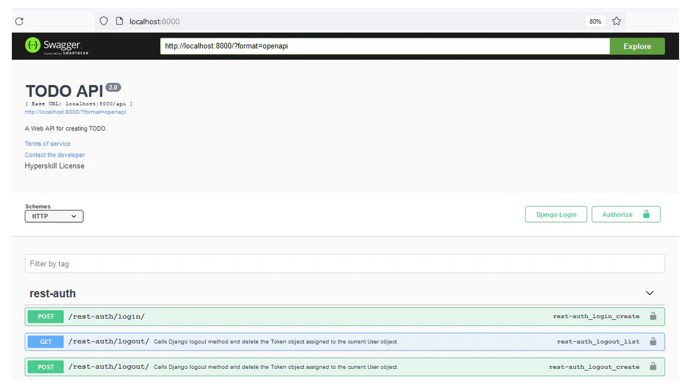
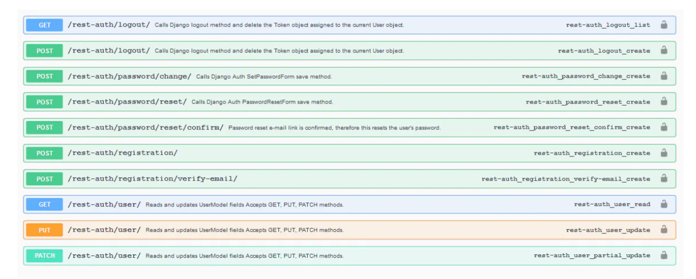
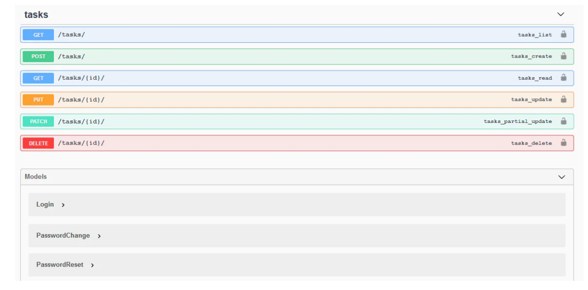

# Document for Everyone

## Description

Our API is almost ready. We have implemented the CRUD functionality, authorization and authentication. While authorization determines what actions a user is allowed to perform, authentication verifies the user's identity. The only thing our project now lacks is the documentation. Everything is done via endpoints, so we need to expose them to our users.

---

## Objectives

REST Framework comes with a built-in documenting feature. Since we've been working with third-party packages, let's use the most popular one — [drf_yasg](https://drf-yasg.readthedocs.io/en/stable/readme.html#installation).

In this stage, your program should document and display all the endpoints the project offers. Comprehensive documentation, like drf_yasg, is crucial because it allows users to understand and interact with the API easily, reducing confusion and errors. It also ensures the API is more accessible for developers and external teams, speeding up the integration process.

Also, don't forget to do these things:

* Specify `TODO API` in the title of your OpenApi info;
* Specify `A Web API for creating TODO.` in the description of your OpenApi info.

---

## Examples

### Example 1: home page on `localhost:8000/`

> In this example, the `django-allauth` package has been used to complete the previous stage, so your endpoints can be slightly different. The endpoint under `rest-auth` can be also different depending on the used package. For this stage, you will have to document all endpoints that your project offers, but the endpoints listed under `tasks` should be similar to the ones shown in the example.
